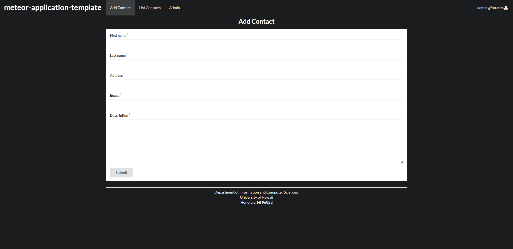
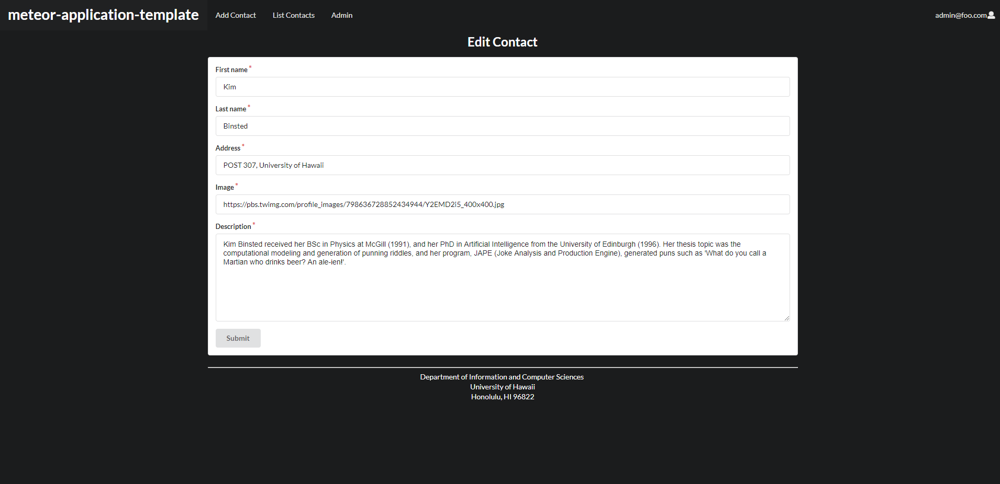

<h2>Installation Instructions</h2>

Download and install meteor if you haven't already from their site <a href='https://www.meteor.com/'>meteor.com</a>

Clone the project using the following url: https://github.com/millarda/digits.git

Open the directory using your preferred command line interface.

CD into the app directory and run the command 'meteor install'

After that completes, run the command 'meteor npm run start'

<h2>The pages on the site</h2>

The landing page contains a typical 3 panel layout filled with sample text and icons.

All pages contain a navbar that can be used to navigate the site and login/logout/signup

On the upper right corner is a login button that allows you to login or signup with an account

A default user account is 'john@foo.edu' with password 'changeme'

A default admin account is 'admin@foo.edu' with password 'changeme'

A user can also create a new account of type user by navigating to the signup page instead. It requires an email account with the parameters being that text must appear before and after an '@' symbol. A password is also needed.

Once logged in a user can access the Add Contact and List Contacts pages. An admin would also be able to access the Admin page. A user can also sign out from the navbar, taking them to the Sign Out page. This page has no function besides notifying a user of a successful logout.

The Add Contact page contains a form requesting a first name, last name, address, image url and a description. This form then creates a contact with that information that will appear in the List Contacts Page on the client side and in the Contacts database on the server.

The List Contacts page shows the contacts that the logged in user has created. These contacts can be edited with timestamped notes by filling out the box titled 'Add a timestamped note' and clicking submit. These notes will appear on a contact's card. From here, users can also edit their contacts by clicking the edit button.

Clicking the edit button takes the user to the Edit Contact page. This contains a form similar to the one in Add Contact but instead updates the currently selected contact. The submit button must be pressed to commit the edit.

The Admin page is similar to the List Contacts page but instead shows all contacts in the database including ones not created by the admin. The admin also cannot add notes or make edits to contacts from here. Notes actually cannot be viewed on this page at all.

There is also the Not Found page which appears when an invalid url is accessed within the site.

